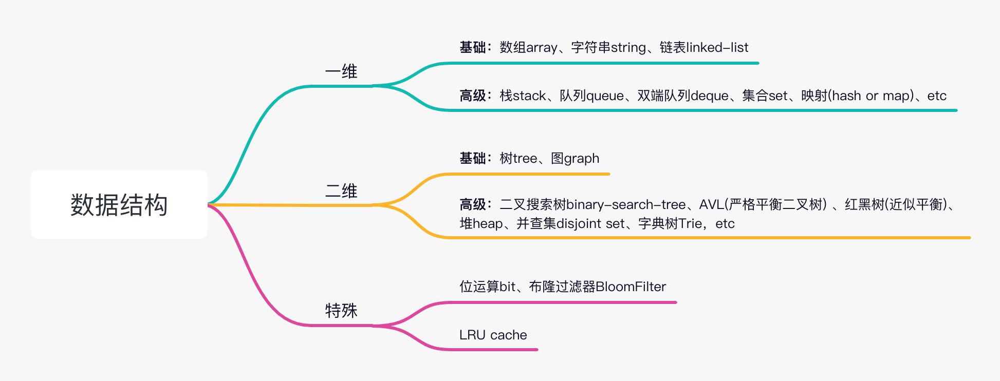
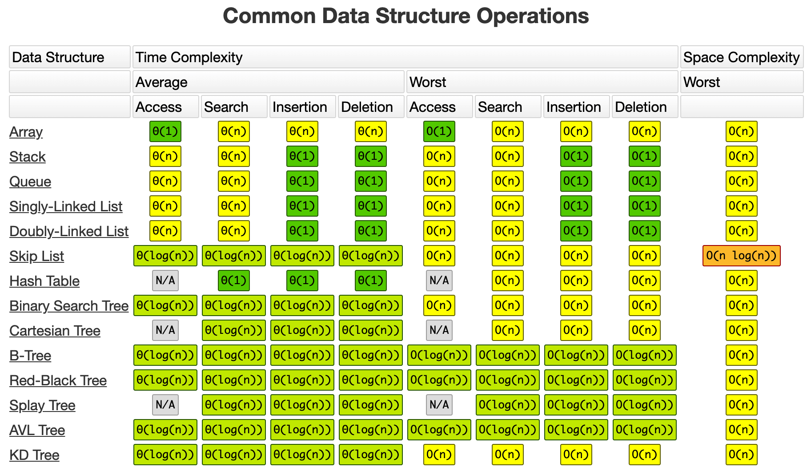
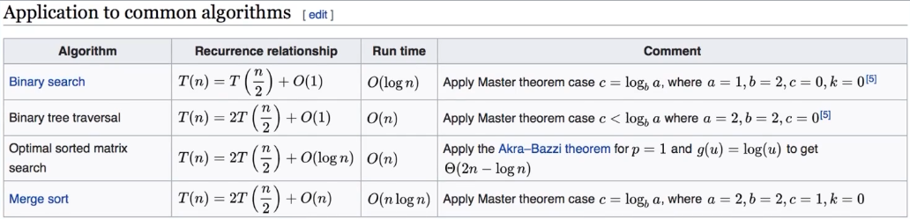

# 数据结构和算法总结

## 学习方法

- 一定要承认数据结构与算法有难度，遇到问题不会非常常见
- 一定要敢于承认不会，五分钟想不出来，直接看（高票）题解，然后用五毒掌变成自己的东西
- 一定要动手写，不能光看题解，要多练习，五毒掌用起来
- 一定要反复练习加上脑图记忆
- 一定要多角度思考，多看高手代码，国际站代码

<u>`最大误区：只做一遍，只为通过而写代码，不看高质量题解！！！`</u>

## 精通之法

**任何领域想要达到精通，一般三步：**

1. chunk it up： 将知识点细化（拆分知识点），然后构建不同知识点之间的联系，形成树形或者脑图结构
2. Deliberate practice：过遍数，将基础知识进行分解和反复练习，着重练习弱项（感觉不舒服），形成肌肉记忆
3. feedback：主动式反馈，比如高票代码或者视频讲解；被动式反馈，比如code review或者高手指点

## 解题四件套

1. Clarification：审题，确认问题的条件以及边界，面试时与面试官沟通、
2. Possible solutions：思路，尽量多想几种方式解题，并分析复杂度，选择当前最优的思路
3. Coding：编写代码，实现前面思考的最优方法
4. Test cases：列举几个符合条件（最好包括边界）的测试用例，进行代码功能测试

## 五毒神掌

**五毒神掌：** 即五遍刷题法，强调练习算法题要过遍数，算法题不仅是做一遍通过而已，而是要通过刻意练习达到对算法熟练的效果。

- **第一掌：** 5~15分钟思考，没有思路马上看题解，有时官方题解夹杂了数学推导、求证等非常复杂不一定适合自己，此时的做法是：先 `BFS广度优先遍历` 一下高赞回答，选择一个适合自己的（比如有图解或代码精简）题解，然后 `DFS深度优先遍历` 把自己全部精力投入进去理解它；
- **第二掌：** 不看别人代码，自己尝试写下来，写完之后可以debug直到leetcode通过状态；一个题可能会有多种解法，要多尝试不同解法；
- **第三掌：** 过了24小时之后，回过头来做重复的题，不同解法的熟练程度--->专项练习；
- **第四掌：** 过了一周之后，回过头来再做重复的题，刻意练习自己薄弱的环节；
- **第五掌：** 面试前1-2周进行恢复性训练。

## 基础知识

### 数据结构

#### 简单归纳



### 常见算法

- if-else,switch -> branch
- for, while loop -> Iteration
- 递归Recursion (分治Divide & Conquer, 回溯Backtrace)
- 搜索Search：深度优先搜索 Depth first search，广度优先搜索 Breadth first search，启发式搜索 A*，  本质是找重复性或递归
- 动态规划 Dynamic Program，    在解决子问题时发现有所谓的最优解，而且在中间过程可以淘汰次优解，那么可以成为该问题有所谓 `最佳子结构`，可以用动态规划思想。
- 二分查找 Binary Search
- 贪心 Greedy
- 数学Math，几何Geometry

### 编程方式

**自顶向下编程：**

1. 首先排布，最核心的函数或者实现，写在最上面，其他细枝末节的靠后排
2. 其次思考实现时，先是主干逻辑，写好伪代码，再逐个实现子逻辑（函数）

### 时间、空间复杂度



`tips：` 注意只看实现的最高复杂度，且常数系数不考虑
这里解释一下递归的时间复杂度，可以通过画递归树辅助计算时间复杂度。

### 递归常见的时间复杂

主定理可以得出下面的情况



- 二分查找，每次递归一分为二，只查询一边，所以时间复杂度为O(logn)
- 二叉树遍历，每次一分为二，两边都会查询，且时间相同，每个元素遍历一次，且仅遍历一次，所以时间复杂度为O(n)
- 有序二维矩阵查找，时间复杂度为O(n)
- 归并排序，时间复杂度为O(nlogn)

### 空间复杂度

1. 申请的数组长度
2. 递归的深度

## 代码模板

### 递归，recursion

**泛型递归模板：**

```golang
func recursion(level int, param interface{}) {   
    // terminator 终结者，先找返回条件 
    if level > MAX_LEVEL {     
        // process result 处理返回结果
        return
    }

    // process current logic 处理当前逻辑
    process(level, param);
    
    // drill down  向下进入下一层
    recursion(level + 1, newParam);   
    
    // revert current status 销毁当前状态
}
```

**递归四部曲：**

- 第一部分：递归终结者，写递归一定要先把递归终止条件写上，否则一不注意可能死循环或无限递归。
- 第二部分：处理当前逻辑块；
- 第三部分：下探到下一层，level参数用来标记当前是哪一层；
- 第四部分：清理当前层的状态，如果需要的话。

**递归误区/注意点：**

- 抵制人肉进行递归（最大误区）
- `找到最近最简单的方法，将其拆解成可重复解决的问题（找最近重复子问题）`，只关心当前层逻辑
- 数学归纳法思维

### 分治, divide_conquer

**分治代码模板：**

```c++
int divide_conquer(Problem *problem, int params) {  
    // recursion terminator  
    if (problem == nullptr) { 
        process_result    
        return return_result;  
    }

    // process current problem  
    subproblems = split_problem(problem, data)

    // drill down 下探到下一层
    subresult1 = divide_conquer(subproblem[0], p1)
    subresult2 = divide_conquer(subproblem[1], p1)
    subresult3 = divide_conquer(subproblem[2], p1)
    ...
    
    // merge  
    result = process_result(subresult1, subresult2, subresult3)  
    // revert the current level status

    return 0;
}
```

**分治四部曲：**

- terminator, 递归终止条件
- process(split your big problem)
- drill down(subproblems), merge(subresult),
- revert states

可以看出分治的本质也是递归，与泛型递归不同的地方在于：

- 分治是把大问题拆解成一个个的子问题，终结条件是没有子问题可拆解了
- 处理当前层逻辑，需要把子问题的结果 `merge在一起之后再 drill down`

> 最经典的例子就是 `归并排序`

### 深度优先搜索，depth-first-search

**递归模板：**

```python
visited = set()
def dfs(node, visited):
    # already visited
    return

    visited.add(node)
    # process current node，处理当前层
    # ... 扩散当前层
    for next_node in node.children():
        if next_node not in visited:
            dfs(next_node, visited)

```

**迭代模板，stack：**

```python
def dfs(self, tree):
    if tree.root is None:
        return []

    # 先把根节点入栈
    visited, stack := [], [tree.root]
    # 只要栈不为空，就一直遍历
    while stack:
        node = stack.pop()
        visited.add(node)
        # 处理当前层逻辑
        process(node)
        nodes = generate_related_nodes(node)
        stack.push(nodes)
    # ... other logic

```

### 广度优先搜索，breath-first-search

**递归模板：**

**迭代模板，queue：**

### `回溯，Backtrack`

**使用场景：**

回溯法（backtrack）常用于遍历列表所有子集，是 DFS 深度搜索一种，一般用于全排列，穷尽所有可能，遍历的过程实际上是一个决策树的遍历过程。时间复杂度一般 O(N!)，它不像动态规划存在重叠子问题可以优化，回溯算法就是 `纯暴力穷举`，复杂度一般都很高。

**通用模板：**

```txt
result = []
func backtrack(选择列表, 路径) {
    if 满足结束条件:
        result.add(路径)
        return
    for 选择 in 选择列表:
        做选择
        backtrack(选择列表, 路径)
        撤销选择，这步贼拉重要
}
```

> 核心就是从选择列表里做一个选择，然后一直递归往下搜索答案，如果遇到路径不通，就返回来撤销这次选择。

**大白话自己的理解：**

- 有很多步 `选择` 要做，我们不知道每步选择应该选啥，所以，我们先随便选一个，然后前往下一步，继续做选择；
- 当我们走到某个位置，发现无路可走时，我们就往回退（return），退到上一步，重新做选择。